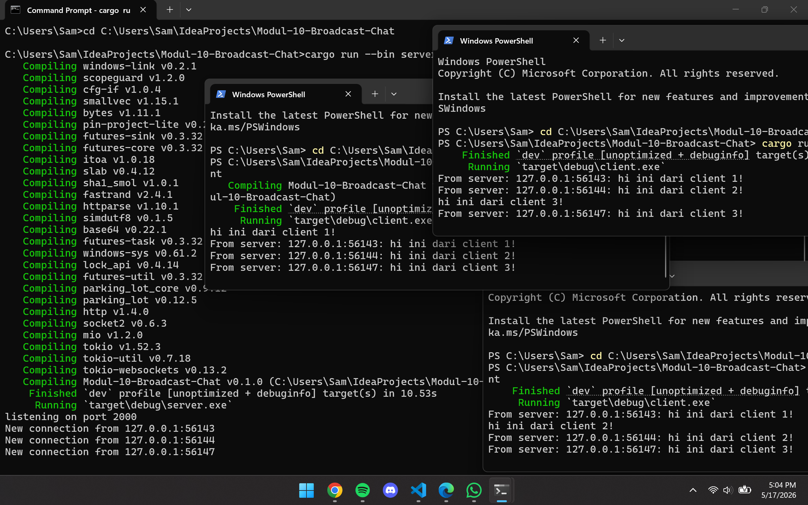

# Modul 10 Broadcast Chat

## Experiment 2.1

Untuk menjalankan program ini, saya membuka 1 terminal untuk server dan 3 terminal untuk client. Server dijalankan dengan `cargo run --bin server`, sedangkan masing-masing client dijalankan dengan `cargo run --bin client`. Setelah semua client berhasil connect, saya coba mengetik message yang berbeda di setiap client. Dari hasil run terlihat bahwa setiap message yang diketik di salah satu client akan dikirim ke server, lalu diteruskan lagi ke client lain. Karena itu isi pesan dari client 1, client 2, dan client 3 bisa terlihat bersama di beberapa terminal client. Jadi dari percobaan ini bisa dilihat bahwa server berfungsi sebagai penghubung yang menerima pesan dari satu client lalu membagikannya ke semua client yang sedang terhubung.