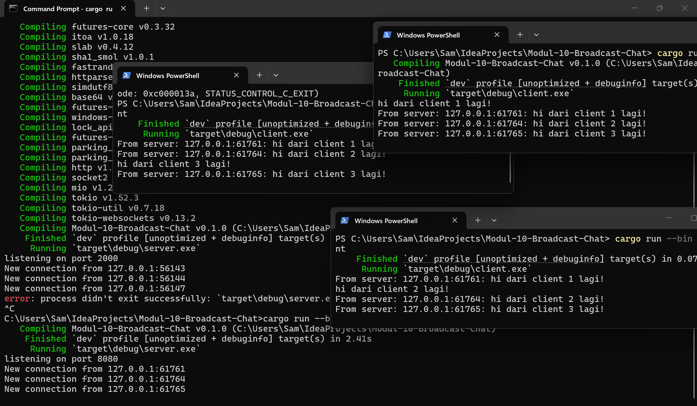
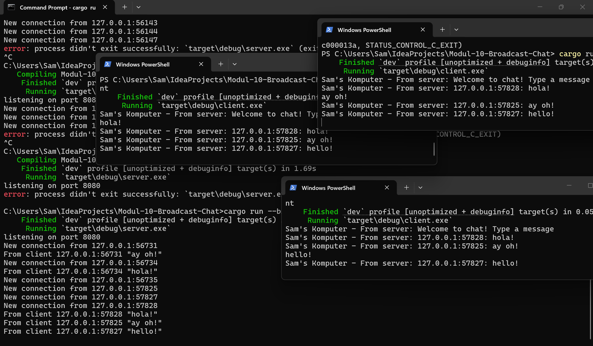

# Modul 10 Broadcast Chat

## Experiment 2.1

Untuk menjalankan program ini, saya membuka 1 terminal untuk server dan 3 terminal untuk client. Server dijalankan dengan `cargo run --bin server`, sedangkan masing-masing client dijalankan dengan `cargo run --bin client`. Setelah semua client berhasil connect, saya coba mengetik message yang berbeda di setiap client. Dari hasil run terlihat bahwa setiap message yang diketik di salah satu client akan dikirim ke server, lalu diteruskan lagi ke client lain. Karena itu isi pesan dari client 1, client 2, dan client 3 bisa terlihat bersama di beberapa terminal client. Jadi dari percobaan ini bisa dilihat bahwa server berfungsi sebagai penghubung yang menerima pesan dari satu client lalu membagikannya ke semua client yang sedang terhubung.

## Experiment 2.2

Di experiment ini saya mengubah port websocket yang sebelumnya `2000` jadi `8080`. Perubahan ini dilakukan di server dan juga client, supaya keduanya tetap memakai alamat koneksi yang sama. Setelah itu program saya jalankan lagi seperti sebelumnya dengan 1 server dan 3 client. Dari hasil run terlihat bahwa semuanya masih bisa connect dengan normal dan pesan juga masih bisa dikirim seperti biasa. Jadi walaupun portnya diubah, cara kerja programnya tetap sama selama server dan client memakai port yang sama. Dari percobaan ini bisa dilihat bahwa perubahan port harus dilakukan di kedua sisi supaya koneksinya tetap jalan.

## Experiment 2.3

Experiment ini saya coba menambahkan sedikit informasi di sisi client, jadi pesan yang tampil sekarang tidak cuma isi chatnya saja, tapi juga ada IP dan port pengirimnya. Setelah programnya saya jalankan lagi, terlihat bahwa setiap client bisa melihat pesan yang datang beserta asal pengirimnya. Menurut saya perubahan ini membantu karena jadi lebih jelas pesan itu datang dari client yang mana. Dari hasil run juga masih terlihat bahwa alur programnya tetap sama, yaitu pesan dikirim ke server lalu diteruskan ke client lain. Jadi walau perubahannya kecil, hasil tampilannya jadi lebih informatif dan lebih mudah dipahami.
